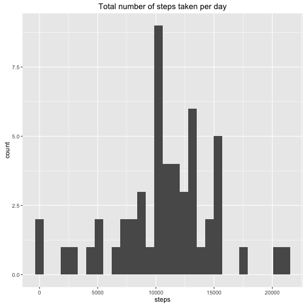
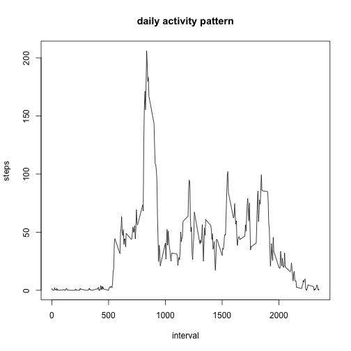
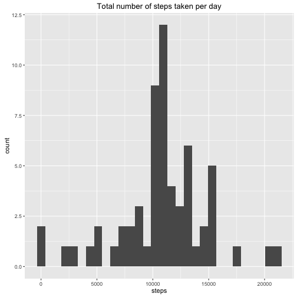
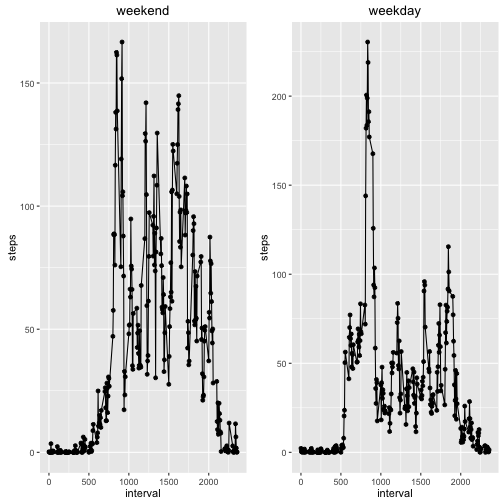

###Loading the data
First of all, we need to load data.

```r
setwd("~/Desktop/R/coursera/Reproducible Research")
a<-read.csv("activity.csv")
```
###What is mean total number of steps taken per day?
A histogram of the total number of steps taken each day is got by the code below.

```r
library(ggplot2)
dailystep<-aggregate(steps~date,a,sum)
p<-ggplot(dailystep,aes(steps))+geom_histogram(bins = 30)+ggtitle("Total number of steps taken per day")
p
```


------------------------
And when we want to see the overview of whole the data, we can use "summary" function like shown below.

```r
summary(dailystep$steps)
```

```
##    Min. 1st Qu.  Median    Mean 3rd Qu.    Max. 
##      41    8841   10760   10770   13290   21190
```
Now we have got the representative values of total number of steps taken per day: *mean*=10700 and *median*=10760.　

###What is the average daily activity pattern?
Let's take a look at a time series plot of the 5-minute interval (x-axis) and the average number of steps taken, averaged across all days (y-axis). 

```r
IntStep<-aggregate(steps~interval,a,mean)
plot(steps~interval,data=IntStep,type="l",main="daily activity pattern")
```


-------------------------
835-840 interval seems to contains the maximum number of steps on average across all the days in the dataset as shown below.

```r
subset(IntStep,steps==max(IntStep$steps))
```

```
##     interval    steps
## 104      835 206.1698
```
###Imputing missing values
Before replacing NAs to some values, let's see how many NAs are in the dataset in the first place.

```r
sum(is.na(a$steps))
```

```
## [1] 2304
```
2304 NAs are there. In this report, I am going to replace each NA with the mean for that 5-minute interval which the NA is in.

```r
a2<-a
replaceNA<-function(i){
        if(is.na(a2[i,1])){
                return(subset(IntStep,interval==a2[i,3])[1,2])
        }
        else{
                return(a2[i,1])
        }
        
}

for(i in 1:nrow(a2)){
        a2[i,1]<-replaceNA(i)
}
```
Now, we have created a new dataset of "a2" that is equal to the original dataset but with the missing data filled in. Let's make a histogram of the total number of steps taken each day again.

```r
dailystep2<-aggregate(steps~date,a2,sum)
p<-ggplot(dailystep2,aes(steps))+geom_histogram(bins=30)+ggtitle("Total number of steps taken per day")
p
```


---------------------
Recaliculating the median and mean, we can see that the renewed values are slightly bigger than the ones before.

```r
mean(dailystep2$steps)
```

```
## [1] 10766.19
```

```r
median(dailystep2$steps)
```

```
## [1] 10766.19
```
###Are there differences in activity patterns between weekdays and weekends?
Although patterns are generally similar, "weekday" has the stronger peak as we can see below.

```r
date<-as.vector(a2$date)
Checker<-(weekdays(as.Date(date,format="%m/%d/%Y")))
Checker<-(Checker=="Saturday")|(Checker=="Sunday")
a3<-cbind(a2,Checker)
a41<-subset(a3,Checker==TRUE)
weekend<-aggregate(steps~interval,a41,mean)
a42<-subset(a3,Checker==FALSE)
weekday<-aggregate(steps~interval,a42,mean)

p1<-ggplot(weekend,aes(y=steps,x=interval))+geom_point()+geom_line()+ggtitle("weekend")
p2<-ggplot(weekday,aes(y=steps,x=interval))+geom_point()+geom_line()+ggtitle("weekday")
library(grid)
grid.newpage()
pushViewport(viewport(layout=grid.layout(1,2)))
print(p1, vp=viewport(layout.pos.row=1, layout.pos.col=1))
print(p2, vp=viewport(layout.pos.row=1, layout.pos.col=2))
```




